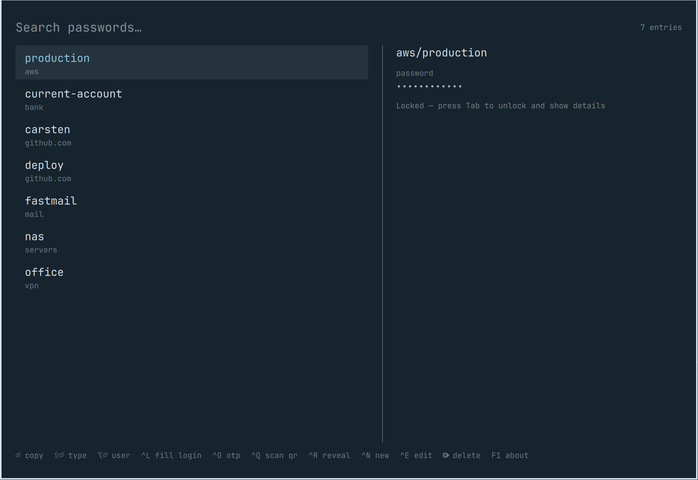

# omapass

> [!WARNING]
> **Early software. Back up your password store before you use it.**
>
> omapass is new, targets an alpha release of Omarchy 4, and has very few users.
> Expect rough edges.
>
> It works on your real `pass` store, and editing and deleting entries really
> does edit and delete them. Back the store up before you start:
>
> ```bash
> tar -czf pass-backup.tar.gz ~/.password-store
> ```
>
> Or point omapass at a throwaway store while you try it, with
> `store = ~/test-store` in its config.

A password manager for [Omarchy 4](https://omarchy.org), built as a shell
plugin and backed by [`pass`](https://www.passwordstore.org/).



It gives you two ways in. A bar icon with a search pulldown for the common
case — find a password, copy it, get on with your day. And a full-screen
overlay, in the same family as Omarchy's clipboard and emoji pickers, that also
creates, edits, generates, renames and deletes entries, so `pass` on the command
line stays optional.

The bar pulldown — click the lock, or search straight away:

```
 󰌾  ← bar icon
 ┌────────────────────────────────┐
 │ git                            │
 ├────────────────────────────────┤
 │ carsten          github.com    │
 │ deploy-bot       github.com    │
 ├────────────────────────────────┤
 │ ⏎ copy  ⇧⏎ type      Manage…   │
 └────────────────────────────────┘
```

And the full manager:

```
SUPER + SHIFT + K

 ┌────────────────────────────────────────────────┐
 │ github                              3 of 24    │
 ├──────────────────────┬─────────────────────────┤
 │ ▸ cs                 │ github.com/cs           │
 │   github.com         │                         │
 │                      │ password                │
 │   deploy-bot         │ ••••••••••••            │
 │   github.com         │                         │
 │                      │ login                   │
 │   personal           │ cs@example.com          │
 │   github.com         │                         │
 ├──────────────────────┴─────────────────────────┤
 │ ⏎ copy  ⇧⏎ type  ⌥⏎ user  ^L fill login  …     │
 └────────────────────────────────────────────────┘
```

## Requirements

Omarchy 4, `pass`, `gpg`, `wl-clipboard`, `wtype`, and `jq` — all but `pass`
ship with Omarchy. `pass-otp` is optional and only needed for one-time codes;
QR enrolment additionally wants `zbar` (`slurp` and `grim` already ship).

## Install

```bash
git clone https://github.com/cschaba/omapass.git
cd omapass
./install.sh
```

`install.sh` links the plugin into `~/.config/omarchy/plugins/cschaba.omapass`, enables
it in the running shell, puts the widget on your bar, and adds a
`SUPER + SHIFT + K` binding to `~/.config/hypr/bindings.conf`.

It edits two files that belong to you — `~/.config/omarchy/shell.json` and
`~/.config/hypr/bindings.conf` — and says so before it does. It only ever adds
or removes its own entries, leaves a `.omapass-backup` copy of each beside the
original, and refuses to touch a `shell.json` it cannot parse rather than
rewriting it. `./uninstall.sh` takes the same entries back out.

To use a different hotkey, set it in the config and run the installer again:

```ini
# ~/.config/omapass/config
keybind = SUPER ALT, P
```

```bash
./install.sh
```

Avoid `SUPER + CTRL + K` — Omarchy already uses it for something else.

If you would rather use Omarchy's own plugin installer:

```bash
omarchy plugin add https://github.com/cschaba/omapass.git --enable --yes
```

Then place the bar widget and add the binding yourself. Note that
`omarchy bar put omapass` reports success but does nothing here: omapass
declares both `overlay` and `bar-widget`, so the shell already considers it
enabled through `plugins[]` and never writes a layout entry. Add it to
`~/.config/omarchy/shell.json` by hand instead:

```jsonc
"bar": { "layout": { "right": [ /* … */ { "id": "omapass" }, { "id": "omarchy.power" } ] } }
```

and the binding:

```
bindd = SUPER SHIFT, K, Passwords, exec, omarchy-shell shell toggle cschaba.omapass
```

To reach it from the Omarchy menu too, add a row to
`~/.config/omarchy/extensions/omarchy-menu.jsonc`:

```jsonc
"passwords": {"icon":"󰌾","label":"Passwords","aliases":["pass","omapass"],
              "action":"omarchy-shell shell toggle cschaba.omapass"},
```

### Removing it

```bash
./uninstall.sh            # take it off the bar, drop the plugin and the keybinding
./uninstall.sh --purge    # also remove omapass's own config and state
```

Your password store and GPG key are never touched. The store is a plain `pass`
store — the `pass` command carries on reading it whether omapass is installed or
not.

### Quitting

To stop omapass without removing it — the bar icon goes, the hotkey stops doing
anything, and the shell unloads it:

```bash
bin/omapass quit
```

Or **Quit omapass** on the About screen (`F1`), which asks first. Everything
stays installed; bring it back with:

```bash
omarchy plugin enable cschaba.omapass
```

### Which one do I want?

| | Stops the app | Removes the app | Removes your passwords |
|---|---|---|---|
| `bin/omapass quit` | yes | no | no |
| `./uninstall.sh` | yes | yes | no |
| [`omapass-reset`](#starting-over) | no | no | yes, after backing them up |

**Quit** to put it away for now. **Uninstall** when you are done with it.
**Reset** to keep omapass but start over with a new key or an empty store. Your
password store is a plain `pass` store and survives all three — only reset
touches it, and only after making a backup.

### First run

omapass needs `pass`, a GPG key, and an initialised password store. If any of
them is missing, the overlay says so and offers to walk you through it —
press Enter and it opens a terminal running `bin/omapass-setup`, which installs
the packages, generates a key, and runs `pass init`.

If you already use `pass`, there is nothing to do; omapass reads the store you
have, including one you clone from another machine.

## Keys

### Bar pulldown

The search field is focused the moment it opens, so just type.

| Key | Action |
|-----|--------|
| `↑` `↓` `PgUp` `PgDn` | move through results |
| `Enter` | copy password |
| `Shift+Enter` | type the password into the window underneath |
| `Alt+Enter` | copy the username |
| `Ctrl+L` | fill a login form |
| `Ctrl+O` | copy the one-time code |
| `Ctrl+Shift+O` | type the one-time code |
| `Ctrl+N` / `Ctrl+E` | open the full manager |
| `Esc` | clear the search, then close |

### Full overlay

| Key | Action |
|-----|--------|
| type anything | filter |
| `↑` `↓` `PgUp` `PgDn` `Home` `End` | move |
| `Enter` | copy password to the clipboard |
| `Shift+Enter` | type the password into the window underneath |
| `Alt+Enter` | copy the username |
| `Ctrl+L` | fill a login form — username, Tab, password, Enter |
| `Ctrl+O` | copy the one-time code (needs `pass-otp`) |
| `Ctrl+Shift+O` | type the one-time code |
| `Ctrl+Q` | scan a QR code into the selected entry |
| `Esc` | leave the fingerprint prompt, when one is shown |
| `Ctrl+R` | reveal the password in the detail pane |
| `Tab` | unlock the store / load details for the selected entry |
| `Ctrl+N` | new entry |
| `Ctrl+E` | edit the selected entry |
| `Delete` / `Ctrl+D` | delete the selected entry |
| `Ctrl+S` | `git pull --rebase && git push` the store |
| `Esc` | clear the filter, then close |

In the editor: `Ctrl+Enter` saves, `Esc` cancels, `Tab` moves between fields.
Renaming is just editing the name — omapass runs `pass mv` for you.

## Configuration

Everything omapass reads lives in one file: **`~/.config/omapass/config`**.
There is none by default — omapass runs on its defaults until you write one.

```bash
bin/omapass config --init    # write a template, every default commented out
bin/omapass config           # the values actually in force, as JSON
bin/omapass config --path    # where it is
```

The format is `key = value`, one per line, with `#` comments. Underscores and
hyphens are interchangeable, so `clip_time` and `clip-time` both work.

### Settings

| Setting | Default | What it does |
|---------|---------|--------------|
| `store` | `~/.password-store` | Where your password store lives. `~` is expanded. Point it elsewhere to keep more than one store. |
| `clip-time` | `45` | Seconds a copied password stays on the clipboard. When it expires the selection is dropped entirely, not just blanked. |
| `type-delay` | `12` | Milliseconds between simulated keystrokes when typing into a window. Raise it if a target application drops characters. |
| `type-focus-delay` | `0.2` | Seconds to wait for focus to return before typing. Raise it if the first characters of a typed password go missing. |
| `reveal-timeout` | `15` | Seconds a revealed password (`Ctrl+R`) stays on screen before it hides itself again. |
| `fingerprint` | `auto` | `auto` requires a scan when a finger is enrolled; `always` requires one whenever the PAM service exists, even if enrolment cannot be confirmed; `off` never does. |
| `fingerprint-grace` | `120` | Seconds a successful scan stays valid before you are asked again. Each surface keeps its own window. |
| `fingerprint-retries` | `1` | Failed fingerprint attempts before falling back to the password prompt. One attempt is a whole `fprintd` conversation, and it retries about three times inside each — so `1` is roughly three touches. |
| `pulldown-rows` | `7` | Rows shown in the bar pulldown. |
| `backup-dir` | `~/.local/state/omapass/backups` | Where `omapass-reset` writes its backups. |
| `log` | `off` | `on` writes a debug log to `~/.local/state/omapass/omapass.log`. See below. |
| `log-max-kb` | `256` | Size cap for that log. Past it the file rotates once and starts again. |
| `keybind` | `SUPER SHIFT, K` | The hotkey that opens omapass, in Hyprland's syntax. Run `./install.sh` again after changing it. |

### An example

```ini
# ~/.config/omapass/config

store             = ~/vaults/work
clip-time         = 20
fingerprint       = off
pulldown-rows     = 12
keybind           = SUPER ALT, P
```

### Precedence

**Environment > config file > default.** An environment variable always wins,
which is how you try something once without editing anything:

```bash
OMAPASS_CLIP_TIME=5 bin/omapass copy some/entry
PASSWORD_STORE_DIR=/tmp/scratch bin/omapass list
```

The variables are `PASSWORD_STORE_DIR` for `store`, and `OMAPASS_` plus the
setting name in capitals with underscores for the rest — `OMAPASS_CLIP_TIME`,
`OMAPASS_TYPE_DELAY`, `OMAPASS_KEYBIND`, and so on.

### When you get it wrong

An unknown setting or an unparseable number produces a warning on stderr and
falls back to the default. It will not stop omapass from starting:

```
omapass: ~/.config/omapass/config: line 4: unknown setting 'clip-timeout'
omapass: clip-time: 'soon' is not a number, using 45
```

Run `bin/omapass config` to see what actually took effect.

### Two notes

The file is **parsed, never sourced**. A config file that can run code is a
config file that can be turned into a payload, so `key = value` is all it
understands.

The bar pulldown's row count can also be set per-widget in Omarchy's own
`shell.json` (Setup → Plugins), and that wins over `pulldown-rows`.

## Debug log

If something misbehaves, start here:

```bash
bin/omapass doctor
```

It prints which copy of omapass is running, its version, where the config and
store are, and whether logging is on. It also warns about the two ways the code
you think you are running is not the code that runs:

- **A stale interface.** The shell loads omapass's windows once, at startup, and
  keeps them for the life of the process. Update omapass and the command line
  goes current immediately while the windows do not — which looks exactly like a
  fix that did not work. `omarchy restart shell` settles it.
- **Two installs.** Installing twice (say `install.sh` once and
  `omarchy plugin add` later) leaves two directories claiming the plugin id.
  omarchy loads one of them and gives no sign which.

Off unless you turn it on:

```ini
# ~/.config/omapass/config
log = on
```

With it on, every operation appends a line saying what ran and how it ended. The
About screen (`F1`) grows an **Open debug log** link while it is on, and
`bin/omapass log --path`, `--status` and `--clear` work from a terminal.

```
2026-08-28T17:22:53Z error: no such entry: <redacted>
2026-08-28T17:22:53Z reveal     exit=1 entry=6379ab0a dur=21ms
2026-08-28T17:22:53Z list       exit=0 entry=- dur=6ms
```

Lines beginning `ui:` come from the interface and carry a sequence number.
Each is written by its own short-lived process, so they can land out of order —
sort by the `#N` to see what actually happened in what order.

**It is written so you can paste it into a bug report without reading it first.**
No passwords, usernames, URLs, OTP secrets — and no entry names either. An entry
name is itself disclosure: a log saying `bank/deutsche-bank` tells anyone who
reads it which bank you use.

Entries appear as the short digest in the `entry=` column, salted freshly on
every run. That is enough to see that three lines concern the same entry without
saying which, and it means nothing once the run has ended. Error messages have
the arguments the command was given substituted out, which is why the line above
reads `<redacted>` where the name would have been.

The file is created `0600`, and rotates once at `log-max-kb` so it cannot grow
without bound.

## Fingerprint unlock

If you have a fingerprint enrolled, omapass puts a scan in front of the vault —
both the overlay and the bar pulldown show a reader prompt instead of your
entries until you touch it.

It is on automatically when, and only when, both of these are true:

- `/etc/pam.d/omarchy-lock-fingerprint` exists, and
- `fprintd-list $USER` reports an enrolled finger

That is the same pair Omarchy's own lock screen tests, and it authenticates
against the same PAM service. Requiring both matters: a reader with nothing
enrolled would put up a prompt that can never be satisfied.

A successful scan holds for two minutes, so opening the picker twice in a row
does not cost two touches. Each surface keeps its own window — unlocking the
pulldown does not unlock the overlay.

### It cannot lock you out

A biometric gate in front of your passwords is only reasonable if it always has
a way past:

- `Esc` closes the surface at any time.
- `pass` on the command line is untouched, and so is `bin/omapass`. The gate is
  in the GUI, not in the store.
- Creating `~/.config/omapass/no-fingerprint` turns it off, and the prompt
  tells you so on screen once the reader has failed you.
- A failed scan does not end the attempt — put your finger down again.

This is a second local factor in front of a GUI, not a cryptographic one. Your
entries are still encrypted to your GPG key and still need its passphrase; the
fingerprint does not protect anything on disk.

> Fingerprint unlock has had far less use than the rest of omapass. If it
> misbehaves, `Esc` and the `pass` command always still work, and
> `fingerprint = off` turns it off entirely.

## One-time codes (TOTP)

omapass stores TOTP secrets the way `pass-otp` does — an `otpauth://` line in
the entry — so anything else that speaks pass-otp reads the same store.

| What | How |
|------|-----|
| Enrol from a QR code | select the entry, `Ctrl+Q`, drag a box over the code on screen |
| Enrol by hand | paste the `otpauth://` URI into the editor's OTP field |
| Copy the current code | `Ctrl+O` (overlay or pulldown) |
| Type the code into a form | `Ctrl+Shift+O` |
| See which entries have one | the detail pane says so; `omapass fields` reports `"otp": true` |

`Ctrl+Q` pipes `grim` into `zbarimg` without the screenshot touching disk, and
replaces an entry's existing `otpauth://` line rather than stacking a second
one. It needs `slurp`, `grim` and `zbar`; the first two ship with Omarchy.

The code itself is treated like a password: copied with the sensitive hint set,
and dropped from the clipboard after `OMAPASS_CLIP_TIME`.

Not implemented: showing a live code with a countdown in the detail pane. Copy
and type cover the actual use, and a live display would mean decrypting the
entry on a timer for as long as the panel is open.

## The CLI

`bin/omapass` is a normal script and works on its own:

```bash
bin/omapass status                  # JSON: what is installed and set up
bin/omapass fingerprint             # JSON: whether fingerprint unlock applies
bin/omapass quit                    # stop the plugin; it stays installed
bin/omapass doctor                  # which copy is running, and is logging on
bin/omapass list                    # JSON: every entry
bin/omapass fields github.com/cs    # JSON: everything except the password
bin/omapass copy github.com/cs
bin/omapass type github.com/cs
bin/omapass login github.com/cs     # username, Tab, password, Enter
bin/omapass otp github.com/cs copy
bin/omapass otp-scan github.com/cs  # read a QR code off the screen
bin/omapass body github.com/cs      # whole entry — the editor's read path
bin/omapass insert new/entry --generate 32 yes < body
bin/omapass rename old/name new/name
bin/omapass remove old/entry
bin/omapass sync
```

Entries are plain `pass` entries — password on the first line, `key: value`
after it, an `otpauth://` line for TOTP:

```
hunter2
login: cs@example.com
url: https://github.com
otpauth://totp/GitHub:cs?secret=…
```

## How it handles secrets

The plugin runs inside `omarchy-shell`, a long-lived process that also draws
your bar and handles notifications. Keeping decrypted passwords in there would
mean keeping them in memory for the length of your session, so omapass mostly
doesn't.

- **Copy, type, login and OTP never enter the shell process.** They are detached
  calls to `bin/omapass`, which pipes the secret from `gpg` straight into
  `wl-copy` or `wtype` and exits.
- **Secrets are never passed as arguments.** They travel in shell variables and
  over stdin, so they never show up in `/proc/*/cmdline` or in `ps` output for
  other users on the machine.
- **The clipboard is marked sensitive.** `wl-copy --sensitive` sets the
  `x-kde-passwordManagerHint` type, which is what Omarchy's own clipboard
  manager checks before recording a copy — so a password you copy here does not
  end up in your clipboard history. The copy is served by a `wl-copy` that
  `timeout` kills after 45 seconds (`OMAPASS_CLIP_TIME`), dropping the selection
  entirely.
- **The detail pane does not decrypt on its own.** Moving the cursor down a list
  of 200 entries should not fire 200 pinentry prompts, so omapass only reads an
  entry for preview once `gpg-agent` already has your key cached. Until then the
  pane says `Locked`, and `Tab` is the deliberate unlock.
- **Two things do hold a password in memory, and only when you ask.** `Ctrl+R`
  reveal, which hides itself again after 15 seconds, and the editor, which needs
  the whole entry in order to save it back. Both are cleared when you close the
  window.

None of this defends against someone who is already running code as you. It
defends against the ordinary ways a password leaks sideways: clipboard history,
process listings, and a long-lived GUI process holding your vault in memory.

### Entry names and fields

An entry name becomes a path inside your store, so it is checked before anything
is written. Rejected: a leading `/` or `-`, `..`, a control character, an empty
folder (`a//b`), any part starting with `.`, a part ending in a space or dot, and
anything over 255 bytes per part.

The dot rule matters more than it looks: without it an entry called
`.git/hooks/pre-commit` would write inside your store's own git repository.

Slashes and punctuation are **not** filtered. `/` is how `pass` makes folders,
and `$`, `&` and the rest are ordinary characters in a password — omapass never
passes anything through a shell, so shell metacharacters have no meaning here.

Field values are stripped of newlines and control characters before an entry is
written. A `pass` entry is a line-oriented format, so a newline pasted into the
username box would otherwise become a *new line in the file* — enough to attach
an unwanted `otpauth://` secret to your entry without it showing in the field
you pasted into. The OTP box accepts an `otpauth://` URI or nothing, and says so
rather than quietly dropping what you typed.

## Starting over

`bin/omapass-reset` empties the slate so setup runs again from scratch — for
starting over with a different GPG key or a fresh store.

**It does not uninstall omapass.** The plugin stays on your bar and the keybinding
keeps working; only your store and its key go. To remove the app itself, use
[`./uninstall.sh`](#removing-it).

```bash
bin/omapass-reset --status         # what is set up, and which backups exist
bin/omapass-reset                  # remove the store and its GPG key
bin/omapass-reset --all            # also uninstall pass and pass-otp
bin/omapass-reset --restore        # put the most recent backup back
```

Nothing is deleted before it has been written to a tarball under
`~/.local/state/omapass/backups`, and `--key` exports the secret key *into that
tarball* first — along with its ownertrust, without which a restored key cannot
encrypt. `--restore` puts the store, the key, and the trust back.

gpg-agent is restarted at the end, so the next run starts locked rather than
inheriting a warm agent from the session before it.

## Developing omapass

omapass is a plain directory of QML and shell scripts, and contributions are
welcome. Everything about building, testing and releasing it is in
[DEVELOPMENT.md](DEVELOPMENT.md).

## License

MIT.
